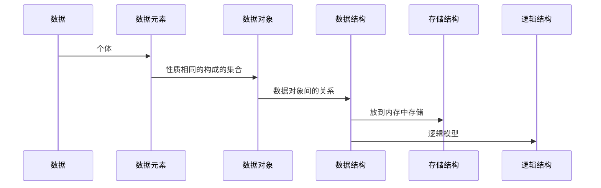

### 数据 (Data)
能输入计算机且能被计算机处理的各种符号集合

 包括：
 1. 数值型数据：数字
 2. 非数值型：文字、图像、声音、图形等

### 数据元素（Data element）
是数据的基本单位，用来描述某一个个体的信息（表中的某一行）
被称为：元素、记录、节点等

### 数据对象（Data Object）
是性质相同的数据元素的集合，是数据的一个子集

 例如：
 1. 整数
 2. 字母字符

### 数据结构（Data Structure）
是相互之间存在一种或多种特定关系的数据元素集合

 其中包括：
 1. 逻辑结构：数据元素之间的逻辑关系
 2. 数据元素以及其关系在计算机内存中的表示（映像）称为数据的物理结构或数据的存储结构
 3. 数据的运算和实现必须在相应的存储结构上实现
 4. 总结：逻辑结构是关系的抽象，存储结构是抽象的具体实现

逻辑结构的划分：
1. 线性机构：有且仅有一个开始和终端节点，并且所有节点都都最多只有一个直接前趋和直接后继。例如：线性表、栈、队列、串
2. 非线性结构：一个节点可能有多个直接前趋和直接后继。例如：树、图

### 抽象数据类型（ADT: abstact data type）

一般指由用户定义的、表示应用问题的数学模型，以及定义在这个模型上的一组操作的总称，具体包括三部分：数据对象、数据对象间的关系的集合、数据对象的基本操作的集合。这个了解就行更多的运用在架构设计当中，**不必首先考虑其中包含的数据对象、关系等各种细节，将不同模块抽象成这种adt来做结构设计，具体的adt实现放在模块内部来做即可，在更高的层次上进行软件分析和设计，从而提升软件的整体性能和利用率**。

抽象数据类型的概念与面向对象方法的思想（类）是一致的。抽象数据类型独立于具体实现，将数据和操作封装在一起，使得用户程序只能通过抽象数据类型定义的某些操作来访问其中的数据，从而实现了信息隐藏。

这里反应的是俩层抽象：

- 抽象数据类型相当于在概念层（抽象层）上描述问题
- 类的相当于在实现层上描述问题

### 总结

注意：

1. 存储结构：

   - 顺序结构
   - 链式结构
   - 索引结构
   - 散列结构

2. 逻辑结构：

   - 集合结构
   - 线性结构
   - 树形结构
   - 图状结构

   